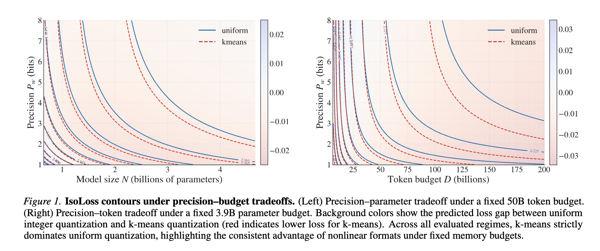

# 1-Bit-Wonder



This repository contains training and inference code supplementing the paper [1-Bit-Wonder: Improving QAT Performance in the Low-Bit Regime through K-Means Quantization](). We implement quantization-aware-training (QAT) with standard integer quantization as well as k-means based quantization which can be run via Torchtitan, as well as providing a Huggingface inference implementation that utilizes [kernels]() optimized for k-means quantization.

## Installation

First, install the the package manager [uv](https://docs.astral.sh/uv/getting-started/installation/). Then create a virtual environment by running 

```bash
uv sync
```
from the root of the repository and activate it via `source .venv/bin/activate`.

Our training code is built on top of [torchtitan](https://github.com/pytorch/torchtitan/tree/v0.2.1) (v0.2.1), for details regarding training configuration we refer to the documentation therein.

Alternatively, if you are only interested in training, the subdirectory `src/llama3_qat/experiment` can be registered and run as a Torchtitan experiment, but this might not work seamlessly on the newest Torchtitan version, as this codebase is still heavily in development.

## Training

To start a training, activate the environment and run `CONFIG_FILE=/path/to/your/config bash run_train.sh`. If no config is specified, the training uses the small debug config `train_configs/debug_model.toml`. 

The specific QAT parameters are contained in the `Quantization` subconfig and quantized linear layers have to activated by choosing the model converter `"quantized_linear"` in the toml file:

```toml
[model]
name = "llama3_qat" # specifies to use our experiment code
converters = ["quantized_linear"] # converts linear layers to quantized linear

[quantization] # specific quantization hyperparameters
quantizer = "nonlinear" # select "nonlinear" for k-means, "sym_int" for integer
target_bit_width = 4 # number of bits used
qat_start_step = 1000 # only applies QAT after this number of steps
buffer_update_interval = 10000 # interval at which the k-means centroids get updated
```

The rest of the config contains standard Torchtitan subconfig and fields.

## Inference

Our inference is based on the Hugginface implementation of Llama3. To prepare a checkpoint after training for inference, use

```bash
python export_to_hf.py /your/checkpoint/after/training /output/path/for/inference/checkpoint
```
with additional command line args (e.g. `--bits 4`) to specify the quantization config.

To run a single-turn chat, you can then load the converted checkpoint with 

```bash
python chat.py --model_path /your/converted/checkpoint
```

or download the checkpoint directly from Huggingface by specifying `--hf_repo` instead. We provide the following checkpoints from our paper:

- [4B Bfloat16]()
- [12B 4-bit k-means quantized]()
- [30B 1-bit k-means quantized]()

All of the above checkpoints use ~8GB of weight memory and can be run on consumer GPUs.


